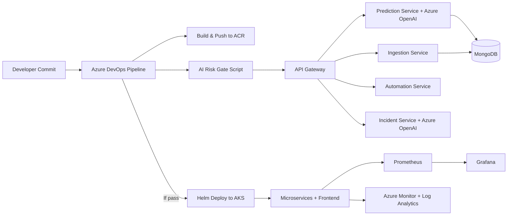

# Architecture

## Microservices
- API Gateway: auth, request routing, orchestration.
- Ingestion Service: collects deployment context and historical data.
- Prediction Service: risk score, failure probability, root-cause forecasting.
- Automation Service: canary/rollback/autoscaling/self-healing decisions.
- Incident Service: AI-generated incident summaries and optimization reports.
